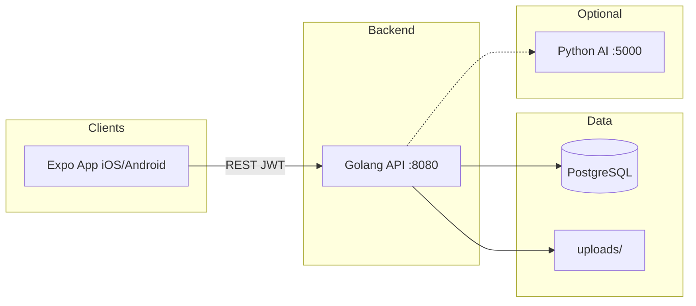

# Jaya Mandiri — Digital Printing Management System

[](https://expo.dev)
[](https://go.dev)
[](https://www.postgresql.org)
[](https://fastapi.tiangolo.com)
[](LICENSE)

Platform manajemen percetakan digital untuk **Jaya Mandiri**. **Aplikasi mobile (Expo)** sebagai client utama; **Golang API** sebagai backend tunggal; **PostgreSQL** sebagai database.

> **Repository:** [github.com/KyutaZx/Digital-Printing](https://github.com/KyutaZx/Digital-Printing)

---

## Daftar Isi

- [Arsitektur](#arsitektur)
- [Peran Pengguna](#peran-pengguna)
- [Alur Pesanan](#alur-pesanan)
- [Struktur Proyek](#struktur-proyek)
- [Instalasi Backend](#instalasi-backend)
- [Mobile (Expo)](#mobile-expo)
- [Dokumentasi](#dokumentasi)
- [Troubleshooting](#troubleshooting)
- [Lisensi](#lisensi)

---

## Arsitektur



| Layanan | Port | Fungsi |
|---------|------|--------|
| **Golang API** | `8080` | Auth JWT, pesanan, pembayaran, desain, produksi, laporan |
| **PostgreSQL** | `5432` | Data utama |
| **Python AI** | `5000` | Deteksi blur gambar (opsional) |
| **Expo** | — | UI mobile (Anda implementasikan) |

Tidak ada layer Laravel di arsitektur target — mobile memanggil API **langsung**.

---

## Peran Pengguna

| Role | Fitur utama |
|------|-------------|
| **customer** | Katalog, keranjang, checkout, upload desain & bukti bayar, lacak pesanan |
| **staff** | Review desain, verifikasi pembayaran, produksi |
| **owner** | Manajemen produk, material, laporan, user, monitoring |

---

## Alur Pesanan

```
Memesan → Verifikasi Pembayaran → Verifikasi Desain → Produksi → Siap Ambil → Selesai
```

- Desain **wajib** diunggah sebelum pembayaran.
- Pembayaran ditolak → tetap verifikasi bayar, unggah ulang bukti.
- Setelah bayar disetujui → `design_review` (banner "Lunas" di UI).
- Semua desain disetujui → produksi otomatis `printing`.

Detail lengkap: **[docs/ALUR-SISTEM.md](docs/ALUR-SISTEM.md)**

---

## Struktur Proyek

```text
.
├── golang-api/              # Backend API (utama)
│   ├── cmd/server/          # go run cmd/server/main.go
│   ├── internal/            # Clean architecture
│   └── uploads/             # File desain & gambar
├── python-ai/               # Microservice blur detection
├── docs/
│   ├── ALUR-SISTEM.md       # Alur bisnis & backend
│   └── MOBILE-EXPO.md       # Panduan integrasi Expo
├── database/
│   ├── migrations/          # SQL migrasi
│   └── database_setup.sql   # Skema + seed awal (pg_dump)
└── Digital_Printing_API.postman_collection.json
```

Folder `app/`, `resources/views/`, `routes/web.php` (Laravel web lama) **tidak digunakan** untuk produk mobile — dapat diabaikan atau dihapus dari fork Anda.

---

## Instalasi Backend

### Prasyarat

- Go 1.25+
- PostgreSQL 15+
- Python 3.9+ *(opsional, AI)*

### 1. Database

Buat database PostgreSQL, import `database/database_setup.sql`, lalu migrasi enum:

```sql
-- Jalankan terpisah (2x Execute di pgAdmin)
ALTER TYPE public.status_order ADD VALUE IF NOT EXISTS 'design_review';
-- COMMIT; lalu:
UPDATE public.orders SET status = 'design_review' WHERE status = 'paid';
```

Lihat `database/migrations/2026_05_23_add_design_review_status.sql`.

### 2. Golang API

```bash
cd golang-api

# Buat .env
# APP_PORT=8080
# DB_HOST=localhost
# DB_PORT=5432
# DB_USER=postgres
# DB_PASS=...
# DB_NAME=printing_postgres
# JWT_SECRET=your_secret_min_32_chars
# AI_SERVICE_URL=http://localhost:5000

go mod download
go run cmd/server/main.go
```

API: `http://localhost:8080`  
Health: `GET /health`

### 3. Python AI *(opsional)*

```bash
cd python-ai
python -m venv venv
venv\Scripts\activate   # Windows
pip install -r requirements.txt
uvicorn main:app --reload --port 5000
```

---

## Mobile (Expo)

Buat proyek Expo terpisah (atau folder `mobile/` di monorepo):

```bash
npx create-expo-app@latest jaya-mandiri
```

Set environment:

```env
EXPO_PUBLIC_API_URL=http://192.168.x.x:8080
```

Gunakan IP LAN (bukan `localhost`) saat tes di HP fisik.

**Panduan lengkap:** **[docs/MOBILE-EXPO.md](docs/MOBILE-EXPO.md)**

- Login / register & simpan JWT
- Keranjang, checkout, upload desain & pembayaran (multipart)
- Navigasi per role
- WebSocket notifikasi

---

## Dokumentasi

| Dokumen | Isi |
|---------|-----|
| [docs/ALUR-SISTEM.md](docs/ALUR-SISTEM.md) | Alur customer/staff/owner, status, backend, diagram |
| [docs/MOBILE-EXPO.md](docs/MOBILE-EXPO.md) | Integrasi Expo + contoh kode |
| [python-ai/README.md](python-ai/README.md) | Layanan AI |
| [Digital_Printing_API.postman_collection.json](Digital_Printing_API.postman_collection.json) | Koleksi API |

---

## Troubleshooting

| Masalah | Solusi |
|---------|--------|
| Mobile tidak bisa connect API | Pakai IP LAN; pastikan firewall izinkan port 8080 |
| 401 Unauthorized | Token expired — login ulang; cek header `Authorization` |
| Upload desain gagal | Cek format file & max 10MB; AI service opsional |
| Error enum `design_review` | Jalankan migrasi SQL (commit terpisah) |
| CORS | Go API sudah reflect `Origin` — cocok untuk Expo dev |

---

## Lisensi

[MIT License](LICENSE)

---

Dikembangkan oleh **[KyutaZx](https://github.com/KyutaZx)**
