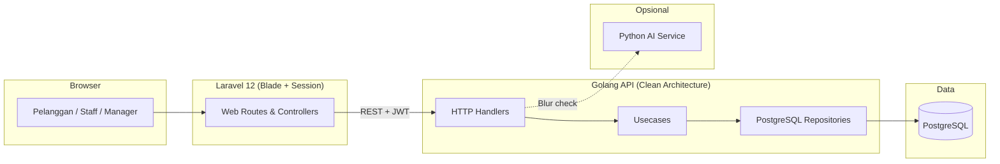

# Jaya Mandiri — Digital Printing Management System

[](https://laravel.com)
[](https://go.dev)
[](https://www.postgresql.org)
[](https://fastapi.tiangolo.com)
[](LICENSE)

Platform manajemen percetakan digital **end-to-end** untuk **Jaya Mandiri Digital Printing**. Pelanggan memesan online, mengunggah desain, membayar, dan memantau status pesanan; tim **Staff** memverifikasi desain & produksi; **Owner/Manager** mengelola produk, stok bahan, laporan keuangan, dan operasional.

> **Repository:** [github.com/KyutaZx/Digital-Printing](https://github.com/KyutaZx/Digital-Printing)

---

## Daftar Isi

- [Gambaran Umum](#gambaran-umum)
- [Arsitektur](#arsitektur)
- [Peran Pengguna](#peran-pengguna)
- [Alur Pesanan Customer](#alur-pesanan-customer)
- [Fitur Utama](#fitur-utama)
- [Tech Stack](#tech-stack)
- [Struktur Proyek](#struktur-proyek)
- [Prasyarat](#prasyarat)
- [Instalasi](#instalasi)
- [Konfigurasi Environment](#konfigurasi-environment)
- [Database](#database)
- [Menjalankan Aplikasi](#menjalankan-aplikasi)
- [URL & Panel](#url--panel)
- [Dokumentasi API](#dokumentasi-api)
- [Troubleshooting](#troubleshooting)
- [Lisensi](#lisensi)

---

## Gambaran Umum

Sistem ini memisahkan tanggung jawab ke beberapa layanan agar mudah dirawat dan diskalakan:

| Layanan | Peran | Port default |
|---------|--------|----------------|
| **Laravel (Blade)** | UI web: landing, katalog, keranjang, pesanan customer, panel Staff & Manager | `8000` |
| **Golang API (Gin)** | Logika bisnis, auth JWT, transaksi, file upload, PDF invoice, WebSocket | `8080` |
| **PostgreSQL** | Database utama (schema `public`) | `5432` |
| **Python AI (opsional)** | Deteksi blur/resolusi file desain saat upload | `5000` |

Laravel berfungsi sebagai **BFF (Backend for Frontend)**: menerima request browser, meneruskan ke Go API dengan token JWT dari session, lalu merender halaman Blade.

---

## Arsitektur



**Pola di `golang-api`:** Domain → Repository (interface) → Usecase → HTTP Handler (Gin).

---

## Peran Pengguna

| Role | Akses utama |
|------|-------------|
| **customer** | Katalog, keranjang, checkout, upload desain, pembayaran, lacak pesanan, profil |
| **staff** | Review desain, verifikasi pembayaran (tergantung konfigurasi), antrian produksi |
| **owner / admin** | Semua fitur manager: produk, material, pesanan, laporan, monitoring staff, kelola user |

---

## Alur Pesanan Customer

Alur bisnis yang diimplementasikan (6 langkah di UI + banner **Lunas**):

```
1. Memesan          → waiting_payment
2. Verifikasi Bayar → payment_verification
   (tolak bayar: tetap payment_verification + unggah ulang bukti)
3. [Banner Lunas]   → setelah pembayaran disetujui
4. Verifikasi Desain→ design_review
5. Produksi         → printing
6. Siap Ambil       → ready
7. Selesai          → completed
```

**Aturan penting:**

- Desain **wajib** diunggah untuk semua item **sebelum** pembayaran.
- Setelah bayar disetujui, status order → `design_review` (bukan `paid`).
- Semua desain disetujui staff → otomatis `printing`.

---

## Fitur Utama

### Pelanggan (Customer)
- Landing page & katalog produk
- Keranjang & checkout
- Upload desain per item (PDF, JPG, PNG, AI, PSD, CDR) + validasi AI opsional
- Upload bukti pembayaran & stepper status pesanan
- Invoice HTML / unduh PDF
- Riwayat pesanan & konfirmasi selesai

### Staff
- Dashboard antrian
- Review desain (setujui / minta revisi)
- Manajemen produksi (mulai cetak / selesai)

### Manager / Owner
- Verifikasi pembayaran
- CRUD produk & variant
- Manajemen stok material
- Monitoring aktivitas staff
- Laporan pendapatan & produk terlaris + **export Excel**
- Kelola user & registrasi staff
- Riwayat pesanan

### Sistem
- Autentikasi JWT (Go) + session Laravel
- Audit log & login log
- Auto-cancel pesanan belum bayar (cron, 24 jam)
- Notifikasi real-time via WebSocket (status pembayaran / produksi)
- Generate invoice PDF (Go)

---

## Tech Stack

| Lapisan | Teknologi |
|---------|-----------|
| Frontend web | Laravel 12, Blade, Tailwind CSS (CDN), Alpine.js |
| API | Go 1.25+, Gin, `database/sql`, JWT |
| Database | PostgreSQL 15+ |
| AI (opsional) | Python 3.9+, FastAPI, TensorFlow |
| Legacy / cadangan | React (Vite) di `resources/js` — fallback route `/` non-Blade |

---

## Struktur Proyek

```text
web-digital-printing/
├── app/
│   ├── Http/Controllers/     # Proxy ke Go API + render Blade
│   └── Services/             # LaporanExcelExporter, dll.
├── database/
│   └── migrations/           # SQL migrasi manual (enum, dll.)
├── golang-api/
│   ├── cmd/server/           # Entry point API (go run cmd/server/main.go)
│   ├── internal/
│   │   ├── domain/           # Entity & repository interfaces
│   │   ├── usecase/          # Business logic
│   │   ├── repository/postgres/
│   │   ├── delivery/http/    # Handlers & routes
│   │   └── infrastructure/   # DB, JWT
│   └── go.mod
├── python-ai/                # Microservice blur detection
├── resources/views/          # Blade templates
│   ├── landing.blade.php
│   ├── orders/
│   ├── manager/
│   └── staff/
├── routes/web.php
├── Digital_Printing_API.postman_collection.json
└── README.md
```

---

## Prasyarat

Pastikan terinstal di mesin development:

| Software | Versi minimum |
|----------|----------------|
| PHP | 8.2+ |
| Composer | 2.x |
| Go | 1.25+ |
| PostgreSQL | 15+ |
| Node.js *(opsional, untuk Vite/React)* | 18+ |
| Python *(opsional, AI)* | 3.9+ |

---

## Instalasi

### 1. Clone repository

```bash
git clone https://github.com/KyutaZx/Digital-Printing.git
cd Digital-Printing
```

### 2. Setup Laravel

```bash
composer install

# Buat file .env (salin dari template proyek Anda atau buat manual)
cp .env.example .env   # jika file ada
php artisan key:generate
```

### 3. Setup Golang API

```bash
cd golang-api
go mod download

# Buat file .env di folder golang-api (lihat tabel di bawah)
cd ..
```

### 4. Setup database PostgreSQL

Buat database, lalu jalankan skema awal sesuai dokumentasi/setup tim Anda, **termasuk** migrasi status `design_review`:

```bash
# Di pgAdmin / psql — jalankan TERPISAH (2x Execute):
# 1) ALTER TYPE ...
# 2) UPDATE ... (opsional)
```

Lihat: `database/migrations/2026_05_23_add_design_review_status.sql`

> **Catatan PostgreSQL:** Nilai enum baru harus di-`COMMIT` dulu sebelum dipakai di `UPDATE`. Jangan jalankan `ALTER TYPE` dan `UPDATE` dalam satu batch Execute.

### 5. Python AI *(opsional)*

```bash
cd python-ai
python -m venv venv
# Windows:
venv\Scripts\activate
# Linux/macOS:
# source venv/bin/activate

pip install -r requirements.txt
```

Detail: [python-ai/README.md](python-ai/README.md)

---

## Konfigurasi Environment

### Laravel — `.env` (root)

```env
APP_NAME="Jaya Mandiri"
APP_URL=http://localhost:8000

# URL Go API (tanpa trailing slash)
GOLANG_API_URL=http://localhost:8080
```

### Golang API — `golang-api/.env`

```env
APP_ENV=development
APP_PORT=8080

DB_HOST=localhost
DB_PORT=5432
DB_USER=postgres
DB_PASS=your_password
DB_NAME=printing_postgres

JWT_SECRET=your_long_random_secret

# Opsional — layanan AI blur detection
AI_SERVICE_URL=http://localhost:5000
```

### Python AI — `python-ai/.env`

```env
APP_HOST=0.0.0.0
APP_PORT=5000
```

---

## Database

- Semua tabel bisnis utama berada di PostgreSQL schema **`public`**.
- Status order menggunakan enum `status_order`, termasuk:  
  `waiting_payment`, `payment_verification`, `design_review`, `printing`, `ready`, `completed`, `cancelled`.
- File upload disimpan di storage Go (path dilaporkan ke DB).

**Seed user (opsional):**

```bash
cd golang-api
go run cmd/seed_users/main.go
```

---

## Menjalankan Aplikasi

Jalankan **3 terminal** (4 jika pakai AI):

**Terminal 1 — Go API**

```bash
cd golang-api
go run cmd/server/main.go
```

**Terminal 2 — Laravel**

```bash
php artisan serve
# http://localhost:8000
```

**Terminal 3 — Python AI *(opsional)***

```bash
cd python-ai
uvicorn main:app --reload --host 0.0.0.0 --port 5000
```

Pastikan `GOLANG_API_URL` di Laravel mengarah ke port Go yang aktif.

---

## URL & Panel

| URL | Keterangan |
|-----|------------|
| `/` | Beranda / landing |
| `/katalog` | Katalog produk |
| `/login`, `/register` | Autentikasi |
| `/cart`, `/pesanan` | Area customer (login) |
| `/staff/dashboard` | Panel staff |
| `/manager/dashboard` | Panel manager/owner |
| `/cara-order` | Panduan pemesanan |
| `/syarat-ketentuan` | Syarat & ketentuan |
| `/kebijakan-privasi` | Kebijakan privasi |
| `/#kontak` | WhatsApp & email di homepage |

---

## Dokumentasi API

Koleksi Postman tersedia di root proyek:

**[Digital_Printing_API.postman_collection.json](Digital_Printing_API.postman_collection.json)**

Import ke Postman, set variabel `base_url` = `http://localhost:8080`, dan gunakan token JWT dari response login.

Endpoint utama (prefix `/api`):

- `POST /api/login`, `POST /api/register`
- `GET /api/products`, `GET /api/cart`
- `POST /api/checkout`, `GET /api/orders/:id`
- `POST /api/payments`, `PUT /api/staff/payments/:id/approve`
- `POST /api/staff/designs/:id/review`
- `PUT /api/staff/production/:id/start`

---

## Troubleshooting

| Masalah | Solusi |
|---------|--------|
| Laravel tidak bisa hubungi API | Cek `GOLANG_API_URL`, pastikan Go API jalan di port 8080 |
| `relation does not exist` | Pastikan `search_path=public` dan skema DB sudah di-import |
| Error enum `design_review` | Jalankan migrasi SQL; commit setelah `ALTER TYPE` |
| Upload desain gagal / AI error | Matikan AI atau set `AI_SERVICE_URL`; service punya fallback |
| Gambar/desain tidak tampil | URL file memakai `GOLANG_API_URL` + path dari API |
| `unsafe use of new value` enum | Pisahkan `ALTER TYPE` dan `UPDATE` menjadi 2 query ter-commit |

---

## Lisensi

Proyek ini dilisensikan di bawah [MIT License](LICENSE).

---

## Kontributor

Dikembangkan oleh **[KyutaZx](https://github.com/KyutaZx)**.

Untuk pertanyaan atau kontribusi, buka [Issues](https://github.com/KyutaZx/Digital-Printing/issues) di repository GitHub.
