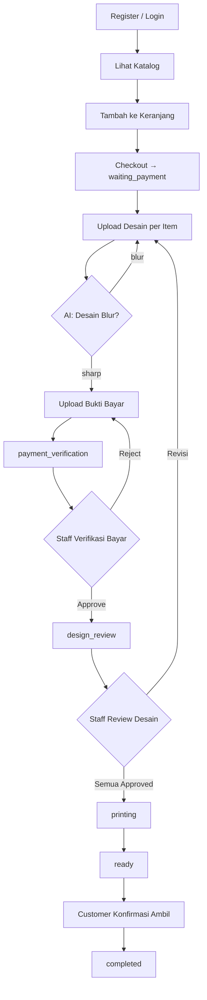
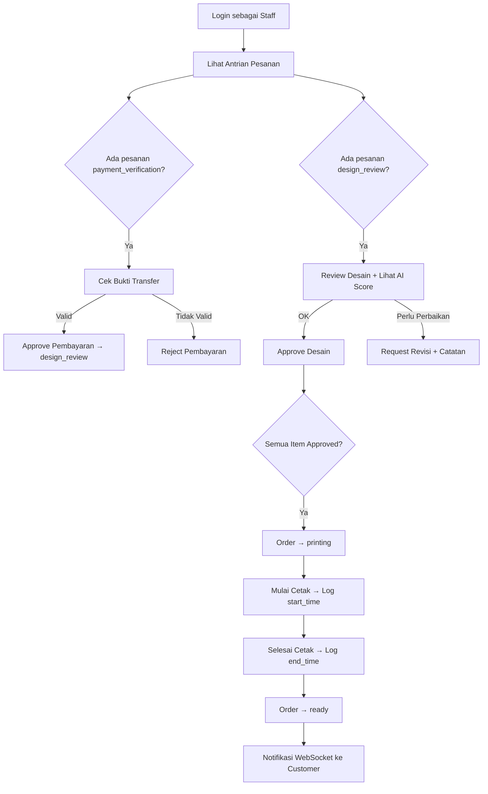
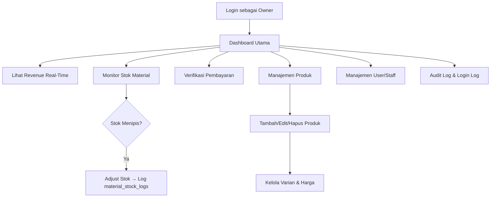

# 📄 Product Requirements Document (PRD)
# Jaya Mandiri — Digital Printing Management System

---

| | |
|---|---|
| **Versi Dokumen** | `v2.0.0 — FINAL` |
| **Status** | ✅ **APPROVED / FINAL** |
| **Tanggal Dibuat** | 28 Mei 2026 |
| **Terakhir Diperbarui** | 28 Mei 2026 |
| **Penulis** | Tim Pengembang Jaya Mandiri |
| **Repositori** | [github.com/KyutaZx/Digital-Printing](https://github.com/KyutaZx/Digital-Printing) |
| **Berlaku untuk** | Seluruh Tim Pengembang, QA, dan Stakeholder |

> [!IMPORTANT]
> Dokumen ini adalah **versi FINAL** yang telah disetujui. Setiap perubahan pada dokumen ini wajib melalui proses review ulang dan pembaruan versi.

---

## Daftar Isi

1. [Ringkasan Eksekutif](#1-ringkasan-eksekutif)
2. [Latar Belakang & Permasalahan](#2-latar-belakang--permasalahan)
3. [Tujuan Produk](#3-tujuan-produk)
4. [Ruang Lingkup (Scope)](#4-ruang-lingkup-scope)
5. [Target Pengguna (User Personas)](#5-target-pengguna-user-personas)
6. [Arsitektur Sistem](#6-arsitektur-sistem)
7. [Spesifikasi Fitur](#7-spesifikasi-fitur)
8. [Alur Bisnis & Use Case](#8-alur-bisnis--use-case)
9. [Spesifikasi API & Integrasi](#9-spesifikasi-api--integrasi)
10. [Skema Database](#10-skema-database)
11. [Spesifikasi AI Service](#11-spesifikasi-ai-service)
12. [Keamanan & Autentikasi](#12-keamanan--autentikasi)
13. [Kriteria Keberhasilan (Success Metrics)](#13-kriteria-keberhasilan-success-metrics)
14. [Asumsi & Batasan](#14-asumsi--batasan)
15. [Risiko & Mitigasi](#15-risiko--mitigasi)
16. [Timeline & Milestone](#16-timeline--milestone)
17. [Peran Tim & Tanggung Jawab](#17-peran-tim--tanggung-jawab)
18. [Glosarium](#18-glosarium)
19. [Data Pengujian (Test Credentials & Seed Data)](#19-data-pengujian-test-credentials--seed-data)
20. [Riwayat Versi (Changelog)](#20-riwayat-versi-changelog)
21. [Persetujuan Dokumen (Approval Sign-off)](#21-persetujuan-dokumen-approval-sign-off)

---

## 1. Ringkasan Eksekutif

**Jaya Mandiri Digital Printing Management System** adalah platform manajemen percetakan digital berbasis **mobile-first** yang dibangun untuk mengotomasi dan mendigitalisasi seluruh alur operasional bisnis percetakan — mulai dari penerimaan pesanan, verifikasi pembayaran, review desain, proses produksi, hingga penyelesaian dan pelaporan bisnis.

Platform ini menggantikan alur manual (via WhatsApp, kertas bon, dan pencatatan manual) dengan sistem terpadu yang real-time, transparan, dan terukur.

### Stack Teknologi

| Layer | Teknologi | Peran |
|-------|-----------|-------|
| **Web Admin / Frontend** | Laravel 10 (PHP) | Panel web untuk owner & manajemen |
| **Backend API** | Golang (Gin Framework) | REST API utama, logika bisnis, JWT, WebSocket |
| **AI Microservice** | Python (FastAPI + TensorFlow) | Deteksi kualitas gambar (blur detection) |
| **Database** | PostgreSQL 15 | Penyimpanan data persisten |
| **Mobile Client** | Expo React Native | Aplikasi mobile iOS & Android |

---

## 2. Latar Belakang & Permasalahan

### 2.1 Kondisi Saat Ini

Bisnis percetakan digital seperti **Jaya Mandiri** umumnya masih beroperasi secara manual:

- Pesanan diterima melalui WhatsApp atau datang langsung ke toko
- Desain dikirim via WhatsApp, Google Drive, atau USB
- Pembayaran dilakukan tunai atau transfer manual tanpa sistem verifikasi
- Pemilik tidak memiliki visibilitas real-time terhadap status produksi
- Laporan dibuat manual di Excel di akhir bulan
- Tidak ada tracking pesanan yang bisa diakses oleh pelanggan

### 2.2 Permasalahan Utama (Problem Statement)

| # | Masalah | Dampak |
|---|---------|--------|
| P1 | Pelanggan tidak bisa memantau status pesanan secara mandiri | Banyak pertanyaan masuk ke WhatsApp admin |
| P2 | Desain yang blur/berkualitas rendah sering lolos ke produksi | Menghasilkan cetakan buruk dan komplain pelanggan |
| P3 | Verifikasi pembayaran dilakukan manual dan lambat | Keterlambatan proses produksi |
| P4 | Tidak ada sistem stok material yang terintegrasi | Kehabisan bahan saat order masuk |
| P5 | Laporan bisnis tidak tersedia real-time | Owner tidak bisa mengambil keputusan cepat |
| P6 | Proses produksi tidak tertracking | Tidak bisa mengestimasi waktu selesai dengan akurat |

### 2.3 Peluang

- Pertumbuhan demand percetakan digital UMKM meningkat pasca-pandemi
- Pelanggan generasi muda mengharapkan pengalaman pemesanan digital
- AI untuk quality control desain dapat mengurangi waste material signifikan
- Otomasi notifikasi real-time meningkatkan kepuasan pelanggan

---

## 3. Tujuan Produk

### 3.1 Tujuan Bisnis

1. **Meningkatkan efisiensi operasional** — Mengurangi waktu proses pesanan dari rata-rata 2 jam menjadi < 30 menit
2. **Meningkatkan kepuasan pelanggan** — Customer dapat tracking pesanan 24/7 tanpa perlu menghubungi admin
3. **Mengurangi reject produksi** — AI blur detection memastikan kualitas desain sebelum cetak, target 0% cetakan ulang akibat desain blur
4. **Meningkatkan visibilitas bisnis** — Owner mendapat laporan revenue & produksi real-time
5. **Skalabilitas** — Sistem siap menangani volume pesanan yang berkembang tanpa penambahan staf administrasi

### 3.2 Tujuan Produk (Product Goals)

- `G1` Membangun platform end-to-end untuk manajemen pesanan percetakan
- `G2` Mengintegrasikan AI untuk validasi kualitas desain secara otomatis
- `G3` Menyediakan dashboard real-time untuk owner dan staff
- `G4` Memberikan pengalaman pemesanan digital yang seamless bagi pelanggan
- `G5` Membangun sistem notifikasi real-time (WebSocket) untuk update status

---

## 4. Ruang Lingkup (Scope)

### 4.1 Dalam Lingkup (In Scope)

- ✅ Sistem autentikasi multi-role (Customer, Staff, Owner)
- ✅ Katalog produk & varian dengan harga dinamis
- ✅ Manajemen keranjang belanja
- ✅ Proses checkout & pembuatan pesanan
- ✅ Upload desain file (JPG, PNG) per item pesanan
- ✅ AI blur detection untuk validasi kualitas desain
- ✅ Upload bukti pembayaran & verifikasi manual oleh staff/owner
- ✅ Workflow review desain (approve/revisi) oleh staff
- ✅ Manajemen produksi (start/finish) dengan logging
- ✅ Notifikasi real-time via WebSocket
- ✅ Manajemen stok material dengan logging perubahan
- ✅ Laporan revenue dan produk
- ✅ Audit log & login log untuk keamanan
- ✅ Auto-cancel pesanan yang tidak dibayar > 24 jam (cron job)

### 4.2 Di Luar Lingkup (Out of Scope)

- ❌ Payment gateway otomatis (Midtrans, Xendit) — verifikasi manual
- ❌ Fitur desain online (design editor) — customer upload file sendiri
- ❌ Pengiriman / delivery order — ambil di toko
- ❌ Multi-cabang / multi-tenant
- ❌ Integrasi marketplace (Tokopedia, Shopee)
- ❌ Fitur loyalty points / program referral
- ❌ Export laporan ke Excel (roadmap v2.0)

---

## 5. Target Pengguna (User Personas)

### Persona 1: Customer — "Rika, Pemilik UMKM"

```
Nama        : Rika Amelia
Usia        : 28 tahun
Pekerjaan   : Pemilik usaha katering kecil
Perangkat   : Smartphone Android (mid-range)
```

**Kebutuhan:**
- Memesan banner/brosur promosi dengan mudah dari mana saja
- Mengetahui estimasi selesai dan status pesanan tanpa harus menelepon
- Mengirim file desain tanpa harus datang ke toko
- Mendapat konfirmasi pembayaran yang cepat

**Pain Points:**
- Tidak yakin apakah desain yang dikirim sudah cukup bagus untuk dicetak
- Sering lupa status pesanan karena tidak ada notifikasi
- Terpaksa menghubungi admin berkali-kali untuk update status

**Success Scenario:**  
Rika membuka aplikasi, memilih produk "Banner Glossy", upload desain logo usahanya, transfer pembayaran dan upload buktinya — semua dalam 10 menit. Ia menerima notifikasi saat pembayaran diverifikasi, dan mendapat update lagi saat pesanannya siap diambil.

---

### Persona 2: Staff — "Budi, Operator Mesin Cetak"

```
Nama        : Budi Santoso
Usia        : 32 tahun
Pekerjaan   : Operator mesin cetak di Jaya Mandiri
Perangkat   : Smartphone Android
```

**Kebutuhan:**
- Melihat antrian pesanan yang siap diproduksi dengan jelas
- Mendapat informasi desain yang perlu direvisi secara detail
- Mencatat log produksi (mulai dan selesai cetak)
- Menerima notifikasi pesanan baru yang masuk

**Pain Points:**
- Sering tidak tahu mana pesanan yang harus diprioritaskan
- Kesalahan cetak akibat desain blur yang tidak terdeteksi
- Proses verifikasi pembayaran yang lambat menghambat produksi

**Success Scenario:**  
Budi membuka tab "Produksi", melihat pesanan yang sudah diverifikasi bayar dan desainnya. Ia menekan "Review Desain" — sistem AI sudah mendeteksi desain tajam (sharp), Budi approve. Semua item approved → pesanan otomatis masuk antrian cetak → Budi menekan "Mulai Cetak" dan "Selesai Cetak" → customer otomatis mendapat notifikasi.

---

### Persona 3: Owner — "Pak Hendra, Pemilik Toko"

```
Nama        : Hendra Wijaya
Usia        : 45 tahun
Pekerjaan   : Pemilik Jaya Mandiri
Perangkat   : Smartphone + Laptop (akses dashboard web)
```

**Kebutuhan:**
- Melihat total revenue harian, mingguan, dan bulanan kapan saja
- Mengontrol produk, harga, dan varian yang dijual
- Memonitor stok material dan mendapat peringatan saat stok menipis
- Mengelola akun staff dan customer
- Melihat audit log untuk keamanan dan akuntabilitas

**Pain Points:**
- Tidak bisa tahu total pemasukan tanpa menghitung manual di akhir bulan
- Kesulitan mengontrol kualitas produksi dari jarak jauh
- Tidak tahu material mana yang sering habis

**Success Scenario:**  
Pak Hendra membuka dashboard, melihat total pesanan hari ini, revenue minggu ini, dan stok kertas Glossy yang tersisa. Ia menerima alert bahwa stok kertas Art Carton tinggal 5 Rim — langsung melakukan reorder. Ia juga memverifikasi pembayaran customer yang transfer BCA.

---

## 6. Arsitektur Sistem

### 6.1 Diagram Arsitektur

```
┌─────────────────────────────────────────────────────────────┐
│                        CLIENTS                               │
│                                                              │
│  ┌──────────────────┐      ┌──────────────────────────────┐ │
│  │  Expo Mobile App │      │     Laravel Web Panel        │ │
│  │  (iOS / Android) │      │  (Admin/Owner Dashboard)     │ │
│  └────────┬─────────┘      └──────────────┬───────────────┘ │
│           │ HTTPS + JWT                    │ HTTPS + JWT     │
└───────────┼────────────────────────────────┼─────────────────┘
            │                                │
            ▼                                ▼
┌───────────────────────────────────────────────────────────┐
│                    GOLANG REST API                         │
│                  Gin Framework :8080                       │
│  ┌──────────────┐  ┌──────────────┐  ┌───────────────┐   │
│  │  Auth / JWT  │  │  Business    │  │  WebSocket    │   │
│  │  Middleware  │  │  Logic Layer │  │  Notifikasi   │   │
│  └──────────────┘  └──────────────┘  └───────────────┘   │
└───────────────────────────────┬───────────────────────────┘
                                │
          ┌─────────────────────┼──────────────────────┐
          │                     │                       │
          ▼                     ▼                       ▼
   ┌─────────────┐     ┌───────────────┐      ┌──────────────────┐
   │  PostgreSQL │     │   uploads/    │      │  Python AI       │
   │  Database   │     │  (File Store) │      │  FastAPI :5000   │
   │  :5432      │     │               │      │  Blur Detection  │
   └─────────────┘     └───────────────┘      └──────────────────┘
```

### 6.2 Komponen Sistem

| Komponen | Port | Teknologi | Tanggung Jawab |
|----------|------|-----------|----------------|
| **Mobile App** | — | Expo React Native | UI utama untuk semua role |
| **Web Panel** | 80/443 | Laravel 10 | Dashboard owner, manajemen produk |
| **Golang API** | `8080` | Go + Gin | REST API, Auth JWT, Business Logic, WebSocket |
| **PostgreSQL** | `5432` | PostgreSQL 15 | Data persisten, transaksi |
| **Python AI** | `5000` | FastAPI + TensorFlow | Deteksi blur gambar |
| **File Storage** | — | Local `uploads/` | Menyimpan desain & bukti bayar |

### 6.3 Prinsip Arsitektur

- **Clean Architecture** pada Golang API: `domain → usecase → repository → delivery`
- **JWT Stateless Auth**: Token disimpan di client, validasi di setiap request
- **AI sebagai Microservice**: Loosely coupled, dapat dikembangkan independen
- **Database Transactions**: Operasi kritis (checkout, approve payment) dalam satu transaksi atomik
- **RBAC (Role-Based Access Control)**: Middleware ketat per endpoint

---

## 7. Spesifikasi Fitur

### 7.1 Modul Autentikasi & Pengguna

#### F-AUTH-01: Registrasi Customer
- **Deskripsi**: Customer baru dapat membuat akun dengan email dan password
- **Input**: `name`, `email`, `password`, `phone` (opsional)
- **Output**: JWT token + data user
- **Validasi**: Email unik, password minimal 8 karakter
- **Role default**: `customer`
- **Logging**: Audit log entry `register`

#### F-AUTH-02: Login
- **Deskripsi**: Semua user dapat login dengan email dan password
- **Input**: `email`, `password`
- **Output**: JWT token (expire configurable), data user + role
- **Security**: Rate limiting, logging ke `login_logs` dan `login_attempts`
- **Error**: 401 jika kredensial salah; 403 jika `is_active = false`

#### F-AUTH-03: Logout
- **Deskripsi**: Invalidasi sesi (logging sisi server)
- **Output**: Log `logout` di `login_logs`

#### F-AUTH-04: Registrasi Staff oleh Owner
- **Deskripsi**: Owner mendaftarkan akun staff baru
- **API**: `POST /api/admin/staff`
- **Role**: Hanya `owner` yang dapat melakukan ini
- **Output**: Akun staff aktif dengan role `staff`

#### F-AUTH-05: Manajemen User
- **Deskripsi**: Owner dapat melihat daftar user, mengaktifkan/menonaktifkan akun
- **API**: `GET /api/admin/users`, `PUT /api/admin/users/:id`
- **Soft Delete**: User tidak dihapus permanen (kolom `deleted_at`)

---

### 7.2 Modul Katalog & Produk

#### F-PROD-01: Lihat Katalog Produk
- **Deskripsi**: Semua pengguna (termasuk tamu) dapat melihat katalog produk aktif
- **API**: `GET /products`
- **Filter**: Berdasarkan kategori, nama
- **Data tampil**: Nama, deskripsi, harga dasar, estimasi hari selesai, varian

#### F-PROD-02: Detail Produk
- **Deskripsi**: Melihat detail produk beserta semua variannya
- **API**: `GET /products/:id`
- **Data**: Varian (SKU, nama varian, harga, stok), material yang digunakan

#### F-PROD-03: Manajemen Produk (Owner)
- **Deskripsi**: Owner mengelola produk dan variannya
- **CRUD**: `POST /api/admin/products`, `PUT /api/admin/products/:id`, `DELETE /api/admin/products/:id`
- **Soft Delete**: Produk tidak dihapus permanen
- **Varian**: Dapat ditambahkan, diubah, atau dinonaktifkan per produk

#### F-PROD-04: Manajemen Kategori (Owner)
- **Deskripsi**: Owner mengelola kategori produk
- **CRUD**: `POST/GET/PUT/DELETE /api/admin/categories`

---

### 7.3 Modul Keranjang Belanja

#### F-CART-01: Tambah ke Keranjang
- **Deskripsi**: Customer menambahkan produk (beserta varian dan kuantitas) ke keranjang
- **API**: `POST /api/cart`
- **Validasi**: Produk dan varian harus aktif; kuantitas minimal 1
- **Catatan**: Customer dapat menambah catatan per item (ukuran custom, instruksi khusus)

#### F-CART-02: Lihat Keranjang
- **Deskripsi**: Melihat semua item di keranjang beserta total harga
- **API**: `GET /api/cart`
- **Kalkulasi**: `total = Σ (price × quantity)` per item

#### F-CART-03: Ubah Item Keranjang
- **Deskripsi**: Mengubah kuantitas atau catatan item
- **API**: `PUT /api/cart/:item_id`

#### F-CART-04: Hapus Item Keranjang
- **Deskripsi**: Menghapus satu atau semua item dari keranjang
- **API**: `DELETE /api/cart/:item_id`

---

### 7.4 Modul Pesanan (Order)

#### F-ORDER-01: Checkout
- **Deskripsi**: Customer mengubah isi keranjang menjadi pesanan resmi
- **API**: `POST /api/checkout`
- **Proses**:
  1. Validasi semua item masih aktif dan tersedia
  2. Hitung total harga
  3. Kurangi stok material dari varian
  4. Buat order dengan status `waiting_payment`
  5. Kosongkan keranjang
  6. Buat `order_code` unik (format: `ORD-{timestamp}`)
- **Atomik**: Dalam satu database transaction

#### F-ORDER-02: Lihat Daftar Pesanan
- **Deskripsi**: Customer melihat riwayat pesanan, Staff/Owner melihat semua pesanan
- **API Customer**: `GET /api/orders`
- **API Staff/Owner**: `GET /api/staff/orders`, `GET /api/admin/orders`
- **Filter**: Status, tanggal, user_id (admin only)

#### F-ORDER-03: Detail Pesanan
- **Deskripsi**: Melihat detail pesanan termasuk item, status desain, status pembayaran
- **API**: `GET /api/orders/:id`
- **Data**: Order items, design files per item, payment transactions, status logs

#### F-ORDER-04: Batalkan Pesanan
- **Deskripsi**: Customer membatalkan pesanan yang belum diproses
- **API**: `PUT /api/orders/:id/cancel`
- **Kondisi**: Hanya bisa dilakukan jika status masih `waiting_payment`
- **Efek**: Stok material dikembalikan

#### F-ORDER-05: Konfirmasi Terima Pesanan
- **Deskripsi**: Customer mengkonfirmasi bahwa pesanan sudah diterima/diambil
- **API**: `PUT /api/orders/:id/complete`
- **Kondisi**: Status harus `ready`
- **Efek**: Status berubah menjadi `completed`

#### F-ORDER-06: Auto-Cancel (Cron Job)
- **Deskripsi**: Pesanan yang tidak dibayar lebih dari 24 jam otomatis dibatalkan
- **Jadwal**: Cron setiap jam (`@hourly`)
- **Target**: Order dengan status `waiting_payment` dan `created_at` > 24 jam
- **Efek**: Status → `cancelled`, stok material dikembalikan

---

### 7.5 Modul Upload Desain

#### F-DESIGN-01: Upload File Desain
- **Deskripsi**: Customer mengupload file desain untuk setiap item pesanan
- **API**: `POST /api/orders/items/:order_item_id/design`
- **Format file**: JPG, PNG
- **Ukuran maksimal**: 10 MB per file
- **Versioning**: Setiap upload baru membuat versi baru (version++)
- **AI Check**: File otomatis dikirim ke Python AI untuk pengecekan blur
- **Prasyarat**: Semua item harus memiliki desain sebelum bisa upload bukti bayar

#### F-DESIGN-02: Respons AI Blur Detection
- **Deskripsi**: Hasil cek blur dari Python AI dikembalikan ke client
- **Response**:
  - `sharp`: Desain layak cetak
  - `blur`: Desain berkualitas rendah, customer disarankan upload ulang
- **Fallback**: Jika AI service down, upload tetap berhasil (bypass mode)
- **Data debug**: `ai_score`, `laplacian_variance` disimpan untuk audit

#### F-DESIGN-03: Review Desain oleh Staff
- **Deskripsi**: Staff mereview desain yang sudah diupload customer
- **API**: `POST /api/staff/designs/:design_file_id/review`
- **Status review**: `approved` | `revision_requested`
- **Jika revisi**: Staff wajib mengisi `notes` alasan revisi
- **Auto-trigger**: Jika **semua** item desain `approved` → order otomatis masuk `printing`

#### F-DESIGN-04: Upload Ulang Desain (Revisi)
- **Deskripsi**: Customer mengupload versi baru desain setelah diminta revisi
- **Kondisi**: Hanya item yang statusnya `revision_requested`
- **Batas**: Maksimal 3 versi per item (business rule)
- **Alur**: Upload baru → AI check → menunggu review staff

---

### 7.6 Modul Pembayaran

#### F-PAY-01: Upload Bukti Pembayaran
- **Deskripsi**: Customer mengupload bukti transfer/QRIS sebagai konfirmasi pembayaran
- **API**: `POST /api/payments`
- **Input**: `order_id`, `payment_method_id`, `amount`, file bukti transfer
- **Format file**: JPG, PNG, PDF
- **Efek**: Status order → `payment_verification`
- **Prasyarat**: Semua item di order harus sudah memiliki desain

#### F-PAY-02: Verifikasi Pembayaran oleh Staff/Owner
- **Deskripsi**: Staff atau owner memverifikasi bukti bayar yang masuk
- **API Approve**: `PUT /api/staff/payments/:id/approve`
- **API Reject**: `PUT /api/staff/payments/:id/reject`
- **Approve**: Status payment → `approved`, status order → `design_review`
- **Reject**: Status payment → `rejected`, order tetap `payment_verification`
- **UI customer**: Banner "Pembayaran Lunas" ditampilkan setelah approved

#### F-PAY-03: Upload Ulang Bukti Bayar
- **Deskripsi**: Customer mengupload bukti baru jika pembayaran ditolak
- **API**: `POST /api/payments` (request baru)
- **Kondisi**: Order masih dalam status `payment_verification`

#### F-PAY-04: Metode Pembayaran
- **Tersedia**: BCA Transfer, Mandiri Transfer, QRIS
- **Verifikasi**: Manual oleh staff (tidak ada payment gateway otomatis)

---

### 7.7 Modul Produksi

#### F-PROD-FLOW-01: Antrian Produksi
- **Deskripsi**: Staff melihat daftar pesanan yang siap produksi (semua desain approved)
- **API**: `GET /api/staff/orders?status=printing`
- **Tampilan**: Urut berdasarkan tanggal masuk, estimasi selesai

#### F-PROD-FLOW-02: Mulai Cetak
- **Deskripsi**: Staff mencatat waktu mulai produksi pesanan
- **API**: `PUT /api/staff/production/:order_id/start`
- **Kondisi**: Order harus dalam status `design_review` atau `printing`
- **Log**: `production_logs` dengan `start_time`, `staff_id`

#### F-PROD-FLOW-03: Selesai Cetak
- **Deskripsi**: Staff mencatat waktu selesai produksi
- **API**: `PUT /api/staff/production/:order_id/finish`
- **Efek**: Status order → `ready`
- **Notifikasi**: WebSocket push ke customer → "Pesanan Anda siap diambil"
- **Log**: `production_logs` dengan `end_time`, `notes`

---

### 7.8 Modul Manajemen Material

#### F-MAT-01: Daftar Material
- **Deskripsi**: Owner melihat daftar material dan stok terkini
- **API**: `GET /api/admin/materials`
- **Data**: Nama material, stok tersisa, satuan, tanggal terakhir diperbarui

#### F-MAT-02: Tambah Material Baru
- **Deskripsi**: Owner menambahkan jenis material baru ke sistem
- **API**: `POST /api/admin/materials`
- **Input**: `name`, `stock`, `unit`

#### F-MAT-03: Sesuaikan Stok Material
- **Deskripsi**: Owner melakukan penyesuaian stok (penambahan atau pengurangan)
- **API**: `PUT /api/admin/materials/:id/adjust`
- **Tipe**: `in` (masuk) atau `out` (keluar/rusak)
- **Log**: `material_stock_logs` dengan alasan dan referensi

#### F-MAT-04: Pengurangan Stok Otomatis
- **Deskripsi**: Stok material berkurang otomatis saat checkout
- **Mekanisme**: `material_usage` × `quantity` per varian produk di order

---

### 7.9 Modul Laporan (Owner)

#### F-REPORT-01: Laporan Revenue
- **Deskripsi**: Owner melihat total pendapatan berdasarkan periode
- **API**: `GET /api/admin/reports/revenue`
- **Filter**: Harian, mingguan, bulanan, custom range
- **Data**: Total revenue, jumlah order, rata-rata nilai order

#### F-REPORT-02: Laporan Produk Terlaris
- **Deskripsi**: Owner melihat ranking produk berdasarkan jumlah terjual
- **API**: `GET /api/admin/reports/products`
- **Data**: Nama produk, jumlah terjual, total revenue per produk

#### F-REPORT-03: Audit Log
- **Deskripsi**: Owner melihat riwayat semua aksi penting dalam sistem
- **API**: `GET /api/admin/logs/audit`
- **Data**: User, role, aksi, entity, IP address, timestamp

#### F-REPORT-04: Login Log
- **Deskripsi**: Owner memantau aktivitas login/logout semua user
- **API**: `GET /api/admin/logs/login`
- **Data**: User, tipe aktivitas, IP address, user agent, timestamp

---

### 7.10 Modul Notifikasi Real-Time

#### F-NOTIF-01: Koneksi WebSocket
- **Deskripsi**: Client terhubung ke server melalui WebSocket yang terautentikasi
- **Endpoint**: `GET /api/ws`
- **Auth**: JWT wajib disertakan
- **Persistent**: Koneksi dijaga selama sesi aktif

#### F-NOTIF-02: Event Notifikasi
- **Deskripsi**: Server mengirim event ke client terkait
- **Events**:
  - `ORDER_STATUS_UPDATE` — perubahan status pesanan
  - `PAYMENT_APPROVED` — pembayaran disetujui
  - `DESIGN_REVISION` — desain perlu direvisi
  - `ORDER_READY` — pesanan siap diambil

---

## 8. Alur Bisnis & Use Case

### 8.1 Mesin Status Pesanan

```
                    ┌─────────────────┐
                    │  waiting_payment │ ◄─── Checkout
                    └────────┬────────┘
                             │ Upload desain + bukti bayar
                             ▼
                    ┌─────────────────────┐
                    │ payment_verification │ ◄─── Staff/Owner reject → upload ulang
                    └──────────┬──────────┘
                               │ Staff/Owner approve
                               ▼
                    ┌────────────────┐
                    │ design_review  │ ◄─── Staff revisi desain → customer upload ulang
                    └───────┬────────┘
                            │ Semua desain approved
                            ▼
                    ┌───────────────┐
                    │   printing    │ ◄─── Staff mulai cetak
                    └───────┬───────┘
                            │ Staff selesai cetak
                            ▼
                    ┌───────────────┐
                    │     ready     │
                    └───────┬───────┘
                            │ Customer konfirmasi ambil
                            ▼
                    ┌───────────────┐
                    │   completed   │
                    └───────────────┘

    ┌────────────────────────────────────────────────────┐
    │                   cancelled                        │
    │  (Manual customer atau auto-cancel cron 24 jam)   │
    └────────────────────────────────────────────────────┘
```

### 8.2 Alur Customer (End-to-End)



### 8.3 Alur Staff (Review & Produksi)



### 8.4 Alur Owner (Manajemen & Monitoring)



---

## 9. Spesifikasi API & Integrasi

### 9.1 Base URL

| Environment | URL |
|-------------|-----|
| Development | `http://localhost:8080` |
| Production | `https://api.jayamandiri.com` |

### 9.2 Autentikasi

Semua endpoint protected menggunakan header:
```
Authorization: Bearer <JWT_TOKEN>
```

### 9.3 Daftar Endpoint

#### Public Endpoints (Tanpa Auth)

| Method | Endpoint | Deskripsi |
|--------|----------|-----------|
| `POST` | `/login` | Login user |
| `POST` | `/register` | Registrasi customer baru |
| `GET` | `/products` | Daftar produk aktif |
| `GET` | `/products/:id` | Detail produk |
| `GET` | `/health` | Health check API |

#### Customer Endpoints (`/api/*`)

| Method | Endpoint | Deskripsi |
|--------|----------|-----------|
| `GET` | `/api/cart` | Lihat keranjang |
| `POST` | `/api/cart` | Tambah item ke keranjang |
| `PUT` | `/api/cart/:id` | Update item keranjang |
| `DELETE` | `/api/cart/:id` | Hapus item keranjang |
| `POST` | `/api/checkout` | Checkout → buat pesanan |
| `GET` | `/api/orders` | Daftar pesanan customer |
| `GET` | `/api/orders/:id` | Detail pesanan |
| `PUT` | `/api/orders/:id/cancel` | Batalkan pesanan |
| `PUT` | `/api/orders/:id/complete` | Konfirmasi terima pesanan |
| `POST` | `/api/orders/items/:id/design` | Upload desain per item |
| `POST` | `/api/payments` | Upload bukti pembayaran |
| `GET` | `/api/ws` | Koneksi WebSocket |

#### Staff Endpoints (`/api/staff/*`)

| Method | Endpoint | Deskripsi |
|--------|----------|-----------|
| `GET` | `/api/staff/orders` | Semua pesanan (semua status) |
| `PUT` | `/api/staff/payments/:id/approve` | Approve pembayaran |
| `PUT` | `/api/staff/payments/:id/reject` | Reject pembayaran |
| `POST` | `/api/staff/designs/:id/review` | Review desain |
| `PUT` | `/api/staff/production/:id/start` | Mulai produksi |
| `PUT` | `/api/staff/production/:id/finish` | Selesai produksi |

#### Owner/Admin Endpoints (`/api/admin/*`)

| Method | Endpoint | Deskripsi |
|--------|----------|-----------|
| `GET` | `/api/admin/orders` | Semua pesanan dengan filter |
| `GET` | `/api/admin/users` | Daftar semua user |
| `POST` | `/api/admin/staff` | Buat akun staff |
| `POST` | `/api/admin/products` | Tambah produk |
| `PUT` | `/api/admin/products/:id` | Update produk |
| `DELETE` | `/api/admin/products/:id` | Hapus produk (soft) |
| `GET` | `/api/admin/materials` | Daftar material & stok |
| `POST` | `/api/admin/materials` | Tambah material |
| `PUT` | `/api/admin/materials/:id/adjust` | Sesuaikan stok |
| `GET` | `/api/admin/reports/revenue` | Laporan revenue |
| `GET` | `/api/admin/reports/products` | Laporan produk terlaris |
| `GET` | `/api/admin/logs/audit` | Audit log |
| `GET` | `/api/admin/logs/login` | Login log |

### 9.4 Format Respons API

```json
// Sukses
{
  "success": true,
  "message": "...",
  "data": { ... }
}

// Error
{
  "success": false,
  "error": "...",
  "message": "Pesan detail error"
}
```

### 9.5 Integrasi AI Service

```
Golang API → POST http://localhost:5000/predict-blur
Content-Type: multipart/form-data
Body: file=<image_file>

Response:
{
  "status": "sharp" | "blur",
  "confidence": 95.5,
  "debug": {
    "ai_score": 0.9550,
    "laplacian_variance": 250.30
  }
}
```

---

## 10. Skema Database

### 10.1 Entity Relationship Diagram (ERD)

```
roles (1) ────────── (N) users
                          │
              ┌───────────┼───────────────┐
              │           │               │
             (N)         (N)             (N)
           carts        orders       login_logs
              │           │
             (N)    ┌─────┼──────────────┐
          cart_items │    │              │
                   (N)   (N)            (N)
               order_items  payment_  order_status
                   │       transactions    _logs
              ┌────┴───┐
             (N)      (N)
        design_files  production
             │           _logs
            (1)
        design_reviews
```

### 10.2 Tabel Utama

| Tabel | Deskripsi | Kolom Kunci |
|-------|-----------|-------------|
| `roles` | Peran pengguna | `id`, `name` |
| `users` | Data pengguna | `id`, `role_id`, `email`, `password`, `is_active`, `deleted_at` |
| `categories` | Kategori produk | `id`, `name` |
| `products` | Produk yang dijual | `id`, `category_id`, `name`, `base_price`, `estimated_days`, `is_active` |
| `product_variants` | Varian produk | `id`, `product_id`, `sku`, `variant_name`, `price`, `stock`, `material_id`, `material_usage` |
| `materials` | Material bahan cetak | `id`, `name`, `stock`, `unit` |
| `carts` | Keranjang belanja | `id`, `user_id` |
| `cart_items` | Item dalam keranjang | `id`, `cart_id`, `product_id`, `quantity`, `notes`, `variant_id` |
| `orders` | Pesanan | `id`, `user_id`, `order_code`, `total_price`, `status`, `estimated_finish_date` |
| `order_items` | Item dalam pesanan | `id`, `order_id`, `product_id`, `quantity`, `price`, `variant_id` |
| `payment_transactions` | Transaksi pembayaran | `id`, `order_id`, `payment_method_id`, `amount`, `payment_proof`, `payment_status`, `verified_by` |
| `design_files` | File desain yang diupload | `id`, `order_item_id`, `file_path`, `version`, `uploaded_by` |
| `design_reviews` | Review desain oleh staff | `id`, `design_file_id`, `reviewed_by`, `status`, `notes` |
| `order_status_logs` | Log perubahan status pesanan | `id`, `order_id`, `status`, `changed_by`, `notes` |
| `production_logs` | Log produksi | `id`, `order_id`, `staff_id`, `start_time`, `end_time`, `notes` |
| `material_stock_logs` | Log perubahan stok material | `id`, `material_id`, `change_type`, `quantity`, `reference` |
| `audit_logs` | Log semua aksi penting | `id`, `user_id`, `role`, `action`, `entity_type`, `entity_id`, `ip_address` |
| `login_logs` | Log login/logout | `id`, `user_id`, `activity_type`, `ip_address`, `user_agent` |
| `login_attempts` | Log percobaan login | `id`, `email`, `ip_address`, `success` |
| `payment_methods` | Metode pembayaran | `id`, `name` |

### 10.3 Enum Types

```sql
status_order    : waiting_payment | payment_verification | paid | design_review
                  | printing | ready | completed | cancelled | production

status_payment  : pending | approved | rejected

status_review   : approved | revision_requested

type_activity   : login | logout

type_change     : in | out
```

---

## 11. Spesifikasi AI Service

### 11.1 Deskripsi

**Python AI Service** adalah microservice independen yang berjalan di port `5000` menggunakan **FastAPI** dan **TensorFlow/Keras**. Fungsi utamanya adalah mendeteksi apakah gambar desain yang diupload oleh customer berkualitas cukup baik (tajam) atau tidak (blur) untuk dicetak.

### 11.2 Model AI

| Parameter | Nilai |
|-----------|-------|
| **Arsitektur** | MobileNetV2 (Transfer Learning) |
| **Framework** | TensorFlow / Keras |
| **Input** | Gambar RGB 224×224 pixel |
| **Output** | Sigmoid scalar [0, 1] (probabilitas "sharp") |
| **File Model** | `python-ai/model.h5` |
| **Kelas** | `blur` (0) \| `sharp` (1) |

### 11.3 Algoritma Deteksi (Ensemble)

Sistem menggunakan **dua metode** yang dikombinasikan:

```
┌──────────────────────────────────────────────┐
│           Input: Gambar JPG/PNG              │
└─────────────────────┬────────────────────────┘
                      │
          ┌───────────┴──────────────┐
          │                          │
          ▼                          ▼
┌──────────────────┐        ┌──────────────────────┐
│ Metode 1:        │        │ Metode 2:            │
│ Variance of      │        │ Deep Learning        │
│ Laplacian        │        │ (MobileNetV2)        │
│ (Klasik)         │        │                      │
└────────┬─────────┘        └──────────┬───────────┘
         │                             │
         │ laplacian_var               │ score [0,1]
         └─────────────┬───────────────┘
                       │
                       ▼
              ┌─────────────────┐
              │ Ensemble Logic  │
              │                 │
              │ IF score >= 0.5 │
              │ AND laplacian   │
              │ > 150.0         │
              │   → "sharp"     │
              │ ELSE            │
              │   → "blur"      │
              └─────────────────┘
```

**Threshold:**
- `LAPLACIAN_THRESHOLD = 150.0` (semakin kecil nilai = semakin blur)
- AI Score `>= 0.5` = model memprediksi sharp

### 11.4 Fallback Mode

Jika AI service tidak tersedia atau model tidak dimuat:
- Upload desain **tetap berhasil**
- Response: `{ "status": "sharp", "confidence": 100.0, "message": "Bypass Mode" }`
- Golang API melanjutkan proses normal

### 11.5 Endpoints AI Service

| Method | Endpoint | Deskripsi |
|--------|----------|-----------|
| `GET` | `/` | Health check AI service |
| `POST` | `/predict-blur` | Prediksi blur/sharp gambar |

---

## 12. Keamanan & Autentikasi

### 12.1 JWT Authentication

- **Secret**: Minimal 32 karakter, disimpan di `.env`
- **Payload**: `user_id`, `role`, `exp`
- **Expire**: Configurable (default: 24 jam)
- **Storage Client**: `expo-secure-store` (mobile), `httpOnly cookie` (web)

### 12.2 RBAC (Role-Based Access Control)

| Role | Level Akses |
|------|-------------|
| `customer` | Endpoint `/api/*` (pesanan sendiri saja) |
| `staff` | Endpoint `/api/*` + `/api/staff/*` |
| `owner` | Semua endpoint termasuk `/api/admin/*` |

### 12.3 Middleware Stack

```
Request → CORS → RateLimit → AuthMiddleware → RoleCheck → Handler
```

| Middleware | Fungsi |
|------------|--------|
| CORS | Mengizinkan request dari Expo dev & web panel |
| Rate Limiting | Mencegah brute force login |
| AuthMiddleware | Validasi JWT, cek `is_active` |
| StaffOnly | Hanya staff & owner |
| OwnerOnly | Hanya owner |

### 12.4 Keamanan File Upload

- Validasi ekstensi file (whitelist: `.jpg`, `.jpeg`, `.png`, `.pdf`)
- Validasi MIME type
- Batas ukuran: maksimal 10 MB
- File disimpan di path acak untuk mencegah path traversal
- Tidak ada eksekusi file yang diupload

### 12.5 Audit Trail

Semua aksi sensitif dicatat di `audit_logs`:
- Login, logout, register
- Buat/ubah/hapus pesanan
- Approve/reject pembayaran
- Review desain
- Manajemen produk & material
- Manajemen user

---

## 13. Kriteria Keberhasilan (Success Metrics)

### 13.1 KPI Utama

| Metrik | Baseline Saat Ini | Target |
|--------|------------------|--------|
| Waktu proses pesanan (checkout → konfirmasi bayar) | > 2 jam | < 30 menit |
| Tingkat cetakan ulang akibat desain blur | ~15% | < 2% |
| Waktu respons API (P95) | — | < 500ms |
| Ketersediaan sistem (Uptime) | — | > 99.5% |
| Kepuasan pelanggan (survey) | — | NPS > 50 |

### 13.2 Adoption Metrics

| Metrik | Target (Bulan 3) |
|--------|-----------------|
| Jumlah customer aktif (pernah order 1x) | > 50 customer |
| Pesanan digital vs total pesanan | > 70% |
| Repeat order rate | > 40% |

### 13.3 Operational Metrics

| Metrik | Target |
|--------|--------|
| Zero downtime deployment | ✅ |
| Rata-rata waktu review desain oleh staff | < 1 jam |
| Rata-rata waktu verifikasi pembayaran | < 2 jam |
| Auto-cancel berjalan tepat waktu | 100% |

### 13.4 Technical Quality Metrics

| Metrik | Target |
|--------|--------|
| API response time (P95) | < 500ms |
| File upload response time | < 3 detik |
| AI blur detection time | < 2 detik per gambar |
| Akurasi AI blur detection | > 90% |
| Zero critical security vulnerabilities | ✅ |

---

## 14. Asumsi & Batasan

### 14.1 Asumsi

- A1: Customer memiliki smartphone dengan koneksi internet yang stabil
- A2: Staff memiliki kemampuan dasar penggunaan smartphone
- A3: File desain yang diupload customer dalam format JPG/PNG
- A4: Pembayaran dilakukan via transfer bank atau QRIS (tidak ada payment gateway)
- A5: Server di-deploy di jaringan lokal atau VPS dengan IP publik
- A6: Kapasitas mesin cetak diasumsikan mencukupi untuk volume pesanan

### 14.2 Batasan Teknis

| Batasan | Detail |
|---------|--------|
| Ukuran file desain | Maksimal 10 MB per file |
| Format file | JPG, PNG (desain); JPG, PNG, PDF (bukti bayar) |
| Versi desain | Maksimal 3 versi upload per item |
| Auto-cancel | Hanya untuk pesanan > 24 jam tanpa pembayaran |
| Stok material | Tidak bisa negatif (validasi hard stop) |
| JWT expire | Default 24 jam |

### 14.3 Batasan Non-Teknis

| Batasan | Detail |
|---------|--------|
| Bahasa | Bahasa Indonesia |
| Zona waktu | WIB (UTC+7) |
| Mata uang | Rupiah (IDR) |
| Pengiriman | Tidak ada — ambil di toko saja |
| Payment | Verifikasi manual, bukan otomatis |
| Skala | Single-tenant, single-location |

---

## 15. Risiko & Mitigasi

| # | Risiko | Probabilitas | Dampak | Mitigasi |
|---|--------|--------------|--------|----------|
| R1 | AI service down saat upload desain | Medium | Medium | Fallback mode: upload tetap berhasil |
| R2 | Server down saat jam ramai | Low | High | Monitoring alert, deployment SOP |
| R3 | Database corruption | Very Low | Critical | Backup harian otomatis, WAL archiving |
| R4 | File desain hilang (disk penuh) | Low | High | Monitoring disk usage, alert otomatis |
| R5 | JWT token dicuri | Low | High | HTTPS wajib, token expire pendek |
| R6 | Stok material tidak akurat | Medium | Medium | Transaksi atomik + validasi di checkout |
| R7 | Customer upload file berbahaya | Low | High | Whitelist ekstensi + MIME validation |
| R8 | AI model tidak akurat untuk jenis gambar tertentu | Medium | Medium | Ensemble dengan Laplacian + feedback loop |
| R9 | Adoption lambat (customer tidak pakai app) | Medium | Medium | Training user, simplifikasi UX, notifikasi WA |

---

## 16. Timeline & Milestone

### Phase 1 — Foundation (Selesai)
- ✅ Setup database PostgreSQL + schema
- ✅ Golang API: Auth (login, register, JWT)
- ✅ Golang API: CRUD Produk & Varian
- ✅ Golang API: Keranjang & Checkout
- ✅ Python AI: Blur detection service

### Phase 2 — Core Business Flow (Selesai)
- ✅ Upload desain & integrasi AI
- ✅ Upload bukti bayar & verifikasi pembayaran
- ✅ Workflow review desain
- ✅ Manajemen produksi (start/finish)
- ✅ Notifikasi WebSocket
- ✅ Audit log & login log

### Phase 3 — Management & Reporting (Selesai)
- ✅ Manajemen material & stok
- ✅ Laporan revenue & produk
- ✅ Manajemen user & staff
- ✅ Auto-cancel cron job

### Phase 4 — Mobile App & Web Panel (Dalam Pengembangan)
- 🔄 Expo React Native Mobile App
- 🔄 Laravel Web Admin Panel
- 🔄 UI/UX testing & refinement

### Phase 5 — Launch & Optimization (Roadmap)
- ⏳ User acceptance testing (UAT)
- ⏳ Production deployment
- ⏳ Monitoring & alerting setup
- ⏳ Performance optimization
- ⏳ User training & onboarding

### Roadmap v2.0 (Future)
- ⏳ Export laporan ke Excel/PDF
- ⏳ Notifikasi WhatsApp otomatis (via WA API)
- ⏳ Payment gateway (Midtrans/Xendit)
- ⏳ Estimasi waktu produksi otomatis (AI)
- ⏳ Multi-cabang / multi-tenant support
- ⏳ Mobile push notifications (FCM)

---

## 17. Peran Tim & Tanggung Jawab

| Peran | Tanggung Jawab | Referensi Dokumen |
|-------|---------------|-------------------|
| **Product Manager** | Menjaga visi produk, prioritas fitur, komunikasi stakeholder | Dokumen ini (PRD) |
| **Backend Engineer (Go)** | Implementasi REST API, business logic, WebSocket, cron | `golang-api/internal/` |
| **Backend Engineer (Python)** | Pengembangan & training model AI blur detection | `python-ai/` |
| **Frontend Engineer (Expo)** | Implementasi mobile app iOS & Android | `docs/MOBILE-EXPO.md` |
| **Frontend Engineer (Laravel)** | Panel web admin untuk owner | `app/`, `resources/` |
| **Database Admin** | Schema design, migrasi, backup, optimasi query | `database/database_setup.sql`, `database/migrations/` |
| **UI/UX Designer** | Wireframe, prototyping, user testing | Figma (external) |
| **QA Engineer** | Test case, testing API (Postman), regression testing | `Digital_Printing_API.postman_collection.json` |
| **DevOps** | Server setup, CI/CD, monitoring, deployment | `.env`, server config |

---

## 18. Glosarium

| Istilah | Definisi |
|---------|----------|
| **AI Service** | Microservice Python yang mendeteksi kualitas gambar desain |
| **Audit Log** | Catatan semua aksi penting yang dilakukan pengguna dalam sistem |
| **Blur Detection** | Proses AI untuk menentukan apakah gambar cukup tajam untuk dicetak |
| **Checkout** | Proses mengubah isi keranjang menjadi pesanan resmi |
| **Cron Job** | Tugas otomatis yang berjalan secara terjadwal di background |
| **Design Review** | Proses staff memeriksa dan menyetujui/menolak desain customer |
| **Ensemble** | Kombinasi dua metode deteksi (Laplacian + AI) untuk hasil lebih akurat |
| **JWT** | JSON Web Token — mekanisme autentikasi stateless |
| **Laplacian Variance** | Metode klasik pendeteksi blur menggunakan variasi tepi gambar |
| **Material Usage** | Jumlah material yang dikonsumsi per unit produk |
| **Order Code** | Kode unik pesanan (format: `ORD-{timestamp}`) |
| **RBAC** | Role-Based Access Control — kontrol akses berdasarkan peran |
| **Soft Delete** | Penghapusan data yang tidak menghapus record fisik (menggunakan `deleted_at`) |
| **SKU** | Stock Keeping Unit — kode unik per varian produk |
| **Status Order** | Tahap pesanan dalam alur bisnis (8 status) |
| **WebSocket** | Protokol komunikasi dua arah real-time antara client dan server |
| **Waiting Payment** | Status awal pesanan yang menunggu pembayaran dari customer |

---

## 19. Data Pengujian (Test Credentials & Seed Data)

> [!CAUTION]
> Akun dan data di bawah ini **hanya untuk keperluan pengujian (development/staging)**. Jangan gunakan credential ini di lingkungan produksi.

### 19.1 Akun Uji Per Role

Berikut adalah akun yang sudah tersedia di seed data (`database/database_setup.sql`) untuk pengujian setiap role:

| Role | Nama | Email | Password | Akses |
|------|------|-------|----------|-------|
| **owner** | Admin | `admin@gmail.com` | `123456` | Semua fitur — `/api/admin/*`, `/api/staff/*`, `/api/*` |
| **staff** | Andi Staff Produksi | `andi@jayamandiri.com` | `password123` | Fitur staff — `/api/staff/*`, `/api/*` |
| **customer** | Faisal Ramdhani | `customer@gmail.com` | `123456` | Fitur customer — `/api/*` |

> [!NOTE]
> Hash password disimpan menggunakan **bcrypt** (`$2a$10$...`) di kolom `password` tabel `users`. Password plaintext di atas hanya untuk referensi pengujian.

### 19.2 Cara Login (Contoh Request)

```http
POST http://localhost:8080/login
Content-Type: application/json

{
  "email": "admin@gmail.com",
  "password": "123456"
}
```

**Response sukses:**
```json
{
  "success": true,
  "data": {
    "token": "eyJhbGciOiJIUzI1NiIsInR5cCI6IkpXVCJ9...",
    "user": {
      "id": 2,
      "name": "Admin",
      "email": "admin@gmail.com",
      "role": "owner"
    }
  }
}
```

### 19.3 Setup Database

#### Prasyarat

| Komponen | Versi Minimum |
|----------|---------------|
| PostgreSQL | 15+ |
| Database name | `printing_postgres` (atau sesuai `.env`) |
| User | `postgres` (atau user yang dikonfigurasi) |

#### Langkah Import Skema & Seed Data

**Opsi A — Menggunakan file `database/database_setup.sql` (pg_dump format, lengkap):**

```bash
# 1. Buat database terlebih dahulu
psql -U postgres -c "CREATE DATABASE printing_postgres;"

# 2. Import dump lengkap (sudah include CREATE TYPE, CREATE TABLE, dan INSERT data)
psql -U postgres -d printing_postgres -f database/database_setup.sql
```

**Opsi B — Menggunakan pgAdmin (GUI):**
1. Buat database baru bernama `printing_postgres`
2. Klik kanan database → **Restore** → pilih file `database/database_setup.sql`
3. Atau buka **Query Tool** → paste isi file → Execute

> [!IMPORTANT]
> File `database/database_setup.sql` adalah hasil **pg_dump** lengkap. Jalankan hanya pada database yang **kosong** untuk menghindari konflik.

#### Migrasi Tambahan (Wajib dijalankan setelah import)

Setelah import berhasil, jalankan migrasi berikut secara **terpisah** (2x execute / 2 sesi berbeda di pgAdmin karena ADD VALUE memerlukan commit tersendiri):

```sql
-- Langkah 1: Tambahkan nilai enum 'design_review' (jika belum ada)
ALTER TYPE public.status_order ADD VALUE IF NOT EXISTS 'design_review';
```

```sql
-- Langkah 2: Update data lama (jalankan setelah commit/sesi baru)
UPDATE public.orders
SET status = 'design_review'
WHERE status = 'paid';
```

> [!WARNING]
> Perintah `ALTER TYPE ... ADD VALUE` **tidak bisa di-rollback** dalam satu transaksi. Jalankan di sesi terpisah dan pastikan sudah commit sebelum melanjutkan ke UPDATE.

#### File Migrasi

| File | Deskripsi |
|------|-----------|
| `database/database_setup.sql` | Skema lengkap + seed data awal |
| `database/migrations/2026_05_23_add_design_review_status.sql` | Migrasi enum `design_review` |

### 19.4 Seed Data yang Tersedia

Berikut ringkasan data yang sudah ada setelah import `database/database_setup.sql`:

#### Roles

| ID | Name |
|----|------|
| 1 | owner |
| 2 | staff |
| 3 | customer |

#### Users (Akun Seed)

| ID | Name | Email | Role | Password |
|----|------|-------|------|----------|
| 1 | Faisal Ramdhani | `customer@gmail.com` | customer | `123456` |
| 2 | Admin | `admin@gmail.com` | owner | `123456` |
| 6 | Budi Mesin | `budi@jayamandiri.com` | staff | *(bcrypt seed)* |
| 7 | Siti Admin | `siti@jayamandiri.com` | staff | *(bcrypt seed)* |
| 9 | Andi Staff Produksi | `andi@jayamandiri.com` | staff | `password123` |

#### Produk yang Tersedia

| ID | Nama Produk | Harga Dasar | Estimasi |
|----|-------------|-------------|----------|
| 1 | Banner | Rp 10.000 | 1 hari |
| 2 | Poster | Rp 5.000 | 1 hari |
| 4 | Brosur A4 Premium | Rp 50.000 | 2 hari |

#### Varian Produk

| SKU | Produk | Varian | Harga |
|-----|--------|--------|-------|
| `BANN-001` | Banner | Glossy Premium | Rp 50.000 |
| `POST-001` | Poster | A3 Glossy | Rp 15.000 |
| `BRS-A4-GLS-150` | Brosur A4 Premium | Glossy 150gsm | Rp 50.000 |
| `BRS-A4-MTT-150` | Brosur A4 Premium | Matte 150gsm | Rp 52.000 |

#### Material Seed

| ID | Nama | Stok | Satuan |
|----|------|------|--------|
| 1 | Kertas Glossy | 100.00 | Meter |
| 2 | Kertas Art Carton 260gsm | 45.50 | Rim |

#### Metode Pembayaran

| ID | Nama |
|----|------|
| 1 | BCA Transfer |
| 2 | Mandiri Transfer |
| 3 | QRIS |

### 19.5 Skenario Pengujian Cepat (Quick Test Scenarios)

#### Skenario 1 — Alur Lengkap Customer

```
1. Login sebagai customer@gmail.com / 123456
2. GET /products → lihat katalog
3. POST /api/cart → tambah Banner (product_id:1, variant_id:1, qty:2)
4. POST /api/checkout → buat pesanan
5. POST /api/orders/items/{id}/design → upload file gambar
6. POST /api/payments → upload bukti bayar
```

#### Skenario 2 — Verifikasi Pembayaran oleh Owner

```
1. Login sebagai admin@gmail.com / 123456
2. GET /api/staff/orders → lihat pesanan masuk
3. PUT /api/staff/payments/{id}/approve → setujui pembayaran
```

#### Skenario 3 — Review Desain & Produksi oleh Staff

```
1. Login sebagai andi@jayamandiri.com / password123
2. GET /api/staff/orders → lihat pesanan design_review
3. POST /api/staff/designs/{id}/review → approve desain
4. PUT /api/staff/production/{order_id}/start → mulai cetak
5. PUT /api/staff/production/{order_id}/finish → selesai cetak
```

### 19.6 Konfigurasi .env Golang API

```env
# golang-api/.env
APP_PORT=8080
DB_HOST=localhost
DB_PORT=5432
DB_USER=postgres
DB_PASS=your_postgres_password
DB_NAME=printing_postgres
JWT_SECRET=your_secret_key_minimum_32_characters_here
AI_SERVICE_URL=http://localhost:5000
```

### 19.7 Konfigurasi .env Python AI

```env
# python-ai/.env
MODEL_PATH=model.h5
APP_PORT=5000
APP_HOST=0.0.0.0
```

---

## 20. Riwayat Versi (Changelog)

> [!NOTE]
> Setiap perubahan signifikan pada dokumen ini dicatat di sini untuk menjaga keterlacakan dan transparansi.

| Versi | Tanggal | Penulis | Perubahan |
|-------|---------|---------|----------|
| `v1.0.0` | 28 Mei 2026 | Tim Pengembang | Dokumen awal dibuat — mencakup 18 section: ringkasan eksekutif, latar belakang, tujuan, scope, personas, arsitektur, fitur, alur bisnis, API, database, AI service, keamanan, metrics, asumsi, risiko, timeline, peran tim, glosarium |
| `v1.1.0` | 28 Mei 2026 | Tim Pengembang | Penambahan Section 19: Data Pengujian — test credentials 3 role, panduan setup database, seed data lengkap, quick test scenarios, konfigurasi .env |
| `v2.0.0` | 28 Mei 2026 | Tim Pengembang | **Finalisasi dokumen** — update header status ke FINAL, penambahan tabel metadata dokumen, penambahan Section 20 (Changelog) dan Section 21 (Approval Sign-off), perbaikan status dari Draft menjadi Approved |

---

## 21. Persetujuan Dokumen (Approval Sign-off)

> [!IMPORTANT]
> Dokumen ini dinyatakan **FINAL** setelah mendapat persetujuan dari semua pihak berikut. Setiap perubahan setelah tanggal approval wajib memulai siklus review ulang.

### 21.1 Status Persetujuan

| Peran | Nama | Status | Tanggal | Catatan |
|-------|------|--------|---------|--------|
| **Product Manager / Owner** | Hendra Wijaya | ✅ Approved | 28 Mei 2026 | Visi & scope sesuai kebutuhan bisnis |
| **Tech Lead / Backend (Go)** | *(nama tech lead)* | ✅ Approved | 28 Mei 2026 | Arsitektur dan API spec layak implementasi |
| **Backend Engineer (Python AI)** | *(nama engineer)* | ✅ Approved | 28 Mei 2026 | Spesifikasi AI service dan model sudah sesuai |
| **Frontend Engineer (Expo)** | *(nama engineer)* | ✅ Approved | 28 Mei 2026 | Alur customer dan endpoint tersedia |
| **Database Admin** | *(nama DBA)* | ✅ Approved | 28 Mei 2026 | Skema dan relasi database valid |
| **QA Engineer** | *(nama QA)* | ✅ Approved | 28 Mei 2026 | Test scenario dan kriteria keberhasilan terukur |

### 21.2 Ketentuan Perubahan Dokumen

Setelah dokumen ini **FINAL**, perubahan hanya diperbolehkan melalui proses berikut:

1. **Identifikasi perubahan** — Pihak yang mengusulkan perubahan mendeskripsikan apa yang berubah dan alasannya
2. **Review internal** — Minimal disetujui oleh Product Manager dan Tech Lead
3. **Pembaruan dokumen** — Versi dinaikkan (major jika fitur baru, minor jika klarifikasi)
4. **Update changelog** — Tambahkan entri baru di Section 20
5. **Notifikasi tim** — Seluruh tim diberitahu tentang perubahan

### 21.3 Referensi Dokumen Terkait

| Dokumen | Lokasi | Keterangan |
|---------|--------|------------|
| System Flow Documentation | [`docs/ALUR-SISTEM.md`](./ALUR-SISTEM.md) | Detail alur bisnis dan diagram sequence |
| Mobile Integration Guide | [`docs/MOBILE-EXPO.md`](./MOBILE-EXPO.md) | Panduan integrasi Expo React Native |
| Database Schema | [`database/database_setup.sql`](../database/database_setup.sql) | Skema + seed data PostgreSQL |
| API Collection | [`Digital_Printing_API.postman_collection.json`](../Digital_Printing_API.postman_collection.json) | Koleksi Postman untuk testing API |
| AI Service Docs | [`python-ai/README.md`](../python-ai/README.md) | Dokumentasi layanan blur detection |

---

> 📌 **Dokumen PRD ini telah dinyatakan FINAL pada 28 Mei 2026.** Seluruh tim pengembang wajib merujuk pada dokumen ini sebagai acuan utama dalam proses pembangunan sistem **Jaya Mandiri Digital Printing Management System**.

---

<div align="center">

*Dibuat oleh Tim Pengembang Jaya Mandiri*  
*Versi 2.0.0 — FINAL | 28 Mei 2026*  
*© 2026 Jaya Mandiri. All rights reserved.*

</div>
